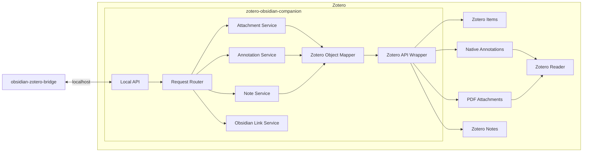

# Zotero Obsidian Companion

Plugin phía Zotero để nhận yêu cầu từ Obsidian và tạo hoặc tìm các object native trong Zotero.

## Mục tiêu

Plugin này đóng vai trò như một cổng giao tiếp nhỏ giữa Obsidian và Zotero.

Logic chính vẫn nằm ở `obsidian-zotero-bridge` phía Obsidian. Companion phía Zotero chỉ nhận lệnh, gọi API của Zotero và trả kết quả.

## Component graph



## Plugin này làm gì?

Ở giai đoạn đầu, plugin chỉ cần làm vài việc:

- nhận request từ Obsidian
- tìm đúng Zotero attachment
- tạo annotation native trong Zotero
- trả lại Zotero annotation key
- hỗ trợ mở ngược về Obsidian

Không cần tự làm sync engine lớn ở phía Zotero.

## Các phần chính

### Local API

Nhận request từ `obsidian-zotero-bridge` qua kết nối local.

### Request Router

Xác định request đang muốn làm gì, ví dụ tìm attachment, tạo annotation, xử lý note hoặc mở lại Obsidian.

### Attachment Service

Tìm đúng PDF attachment trong Zotero từ attachment key hoặc thông tin được gửi sang.

### Annotation Service

Tạo và sau này có thể cập nhật hoặc xóa annotation native trong Zotero.

### Note Service

Phần dành cho note. Chưa phải ưu tiên ở MVP đầu tiên.

### Obsidian Link Service

Hỗ trợ action kiểu `Open in Obsidian` để quay lại object tương ứng phía Obsidian.

### Zotero Object Mapper

Chuyển dữ liệu từ Bridge sang dạng object mà Zotero hiểu được.

### Zotero API Wrapper

Là lớp trực tiếp làm việc với API nội bộ của Zotero. Các service phía trên không cần chạm trực tiếp vào database.

## Ví dụ flow annotation

```text
Obsidian Bridge
    ↓
Local API
    ↓
Request Router
    ↓
Annotation Service
    ↓
Zotero Object Mapper
    ↓
Zotero API Wrapper
    ↓
Native Zotero Annotation
    ↓
Zotero Reader
```

Obsidian gửi dữ liệu kiểu:

```json
{
  "attachmentKey": "ABCD1234",
  "pageIndex": 6,
  "text": "Visual tracking degrades under rapid motion...",
  "rects": [[120, 300, 420, 325]],
  "color": "#ffd400",
  "comment": "",
  "obsidianAnnotationId": "obs-ann-42"
}
```

Companion tạo annotation trong Zotero rồi trả lại:

```json
{
  "annotationKey": "XYZ98765"
}
```

Bridge phía Obsidian sẽ lưu mapping:

```text
obs-ann-42 ↔ XYZ98765
```

## Mở hai chiều

### Obsidian → Zotero

Từ Obsidian có thể mở đúng annotation trong Zotero bằng deep link.

Ví dụ:

```text
zotero://open-pdf/library/items/<ATTACHMENT_KEY>?page=<PAGE>&annotation=<ANNOTATION_KEY>
```

### Zotero → Obsidian

Companion sẽ hỗ trợ một action kiểu:

```text
Open in Obsidian
```

để quay lại đúng annotation hoặc note tương ứng phía Obsidian.

## ID và mapping

Hai app giữ ID riêng.

Ví dụ:

```text
Obsidian annotation ID ↔ Zotero annotation key
Obsidian note ID       ↔ Zotero note key
```

Mapping chính được quản lý ở phía Obsidian Bridge.

Companion chỉ cần nhận đủ thông tin để xử lý request và hỗ trợ mở ngược về Obsidian.

## Note

Note sẽ làm sau annotation.

Mục tiêu sau này:

```text
Obsidian note ↔ Zotero note
```

Hai bên vẫn giữ note riêng nhưng có mapping duy nhất và có thể mở qua lại.

## MVP đầu tiên

1. Plugin load được trong Zotero.
2. Nhận request local từ Obsidian.
3. Tìm attachment theo Zotero attachment key.
4. Tạo native highlight annotation.
5. Trả annotation key về Obsidian.
6. Annotation mở bình thường trong Zotero.
7. Có nền để thêm `Open in Obsidian`.

## Làm sau

Sau khi annotation flow cơ bản chạy ổn mới thêm:

```text
get annotation
update annotation
delete annotation
note read/create/update
change events
sync hai chiều
```

## Nguyên tắc

- plugin phía Zotero càng nhỏ càng tốt
- dùng API của Zotero, không ghi trực tiếp vào `zotero.sqlite`
- giữ annotation native của Zotero
- để Bridge phía Obsidian quản lý mapping và sync logic

## Repo phía Obsidian

Phần logic chính nằm ở:

`obsidian-zotero-bridge`

## Trạng thái

Đang ở giai đoạn thiết kế và nghiên cứu API tạo annotation native trong Zotero.